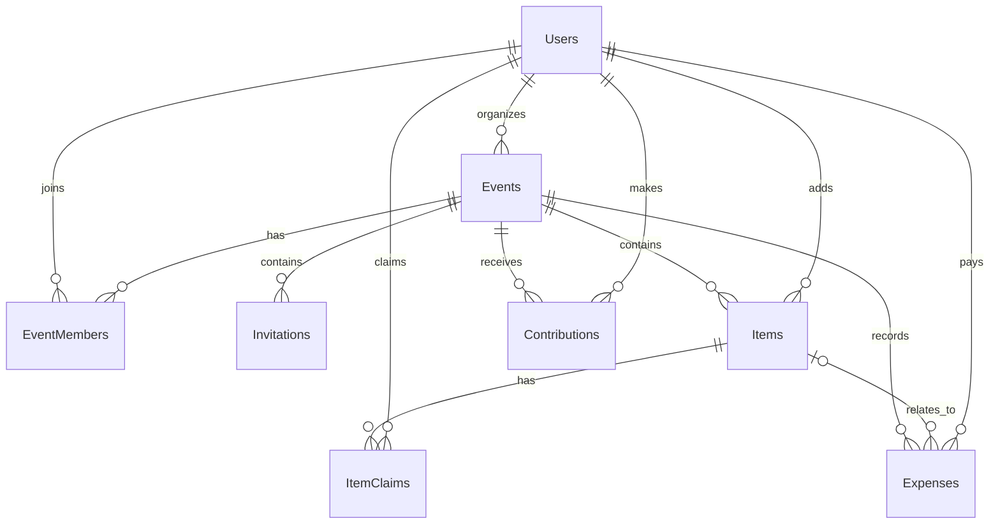

# Gatherly - Entity Relationship Diagram (ERD)

The following diagram describes the database structure and relationships between the main entities in Gatherly.

```mermaid
erDiagram
    Users ||--o{ Events : organizes
    Users ||--o{ EventMembers : joins
    Events ||--o{ EventMembers : has
    Events ||--o{ Invitations : contains
    Events ||--o{ Items : contains
    Users ||--o{ Items : adds
    Items ||--o{ ItemClaims : has
    Users ||--o{ ItemClaims : claims
    Events ||--o{ Expenses : records
    Items o|--o{ Expenses : relates_to
    Users ||--o{ Expenses : pays
    Events ||--o{ Contributions : receives
    Users ||--o{ Contributions : makes
```
